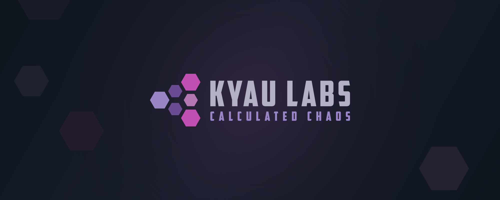

**home**    `/hōm/`

&nbsp;&nbsp;&nbsp;&nbsp;1. A place where one lives; a residence.

**lab**    `/lăb/`

&nbsp;&nbsp;&nbsp;&nbsp;1. A temporary environment for the purpose of learning or testing.

### 📮 About

The KYAU Labs organization is used for all projects that are related-to or developed in my homelab 🧪.

Whether it was learning how to code or automating an Arch Linux server install... most of what I know today would not have been possible without my homelab 💖.

### ✨ Featured Projects

- **[win11tweak](https://github.com/kyaulabs/win11tweak)** — Template-based automated scripts to debloat, disable telemetry, and reconfigure Windows 11 for power-users.
- **[aurora](https://github.com/kyaulabs/aurora)** — A high-performance PHP framework for building dynamic websites and APIs, featuring a modular architecture and built-in caching.
- **[aarch](https://github.com/kyaulabs/aarch)** — A template-based automated installer for Arch Linux.
- **[template](https://github.com/kyaulabs/template)** — A comprehensive PHP repository template shipping with the Aurora PHP Framework, an OpenCode coding harness for AI-assisted development, TDD enforcement with Pest, conventional commits with commitlint, and a SCSS/JS build pipeline.
- **[opencode-panda-syntax](https://github.com/kyaulabs/opencode-panda-syntax)** — A superminimal dark syntax theme for [OpenCode](https://opencode.ai), based on Panda Syntax.

### 🔗 Links

- [kyaulabs.com](https://kyaulabs.com)
- [YouTube](https://www.youtube.com/@kyaulabs)
- [Instagram](https://www.instagram.com/kyaulabs)
- [Discord](https://discord.gg/DSvUNYm)

### 🤝 Contributing

We welcome contributions! Please review the [contributing guidelines](https://github.com/kyaulabs/.github/blob/master/CONTRIBUTING.md) and [code of conduct](https://github.com/kyaulabs/.github/blob/master/CODE_OF_CONDUCT.md) before submitting a pull request.
